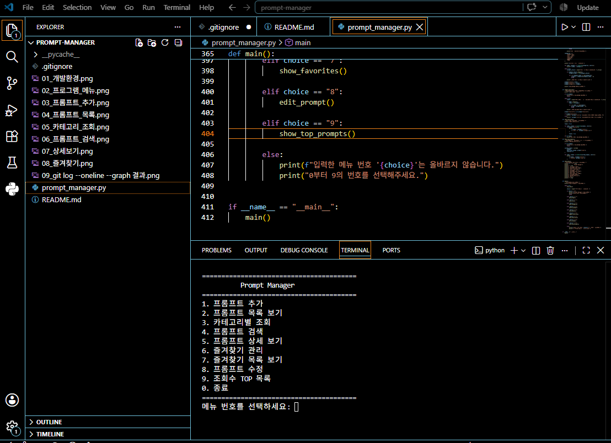
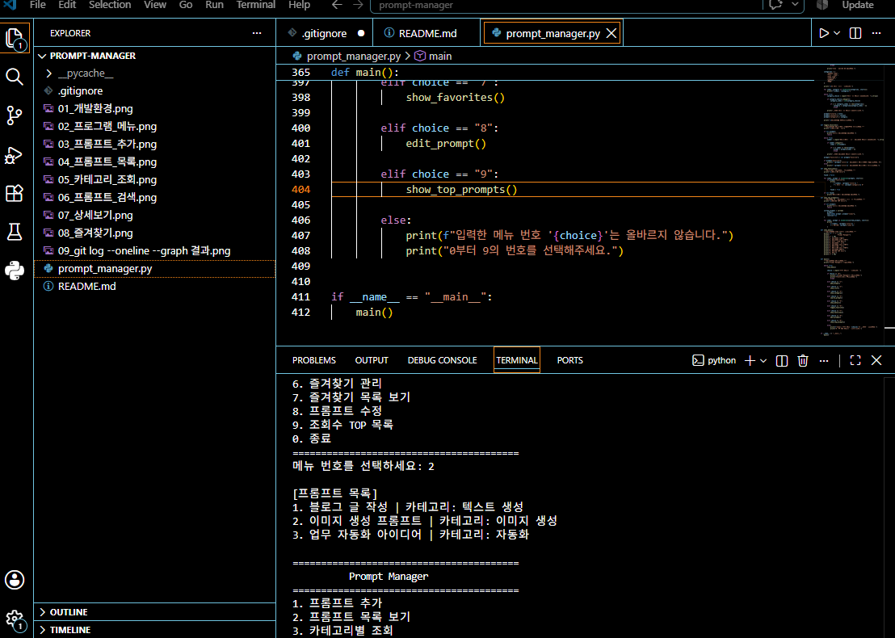
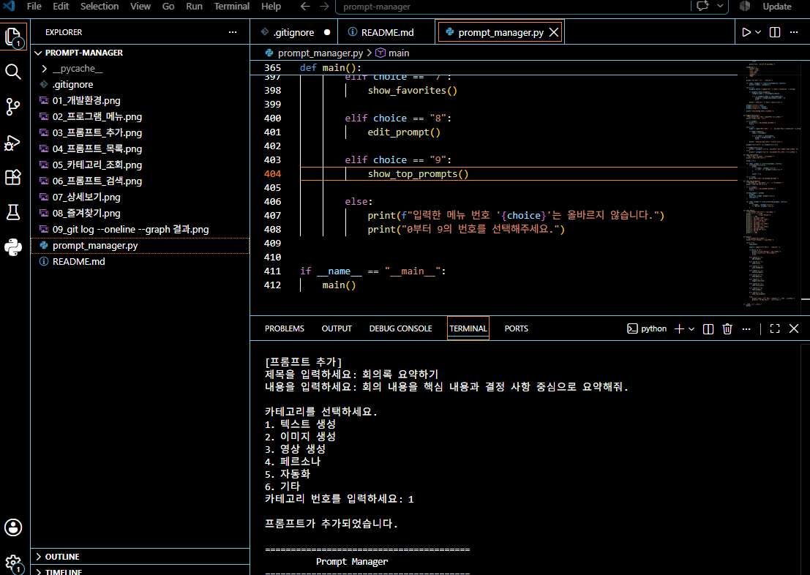
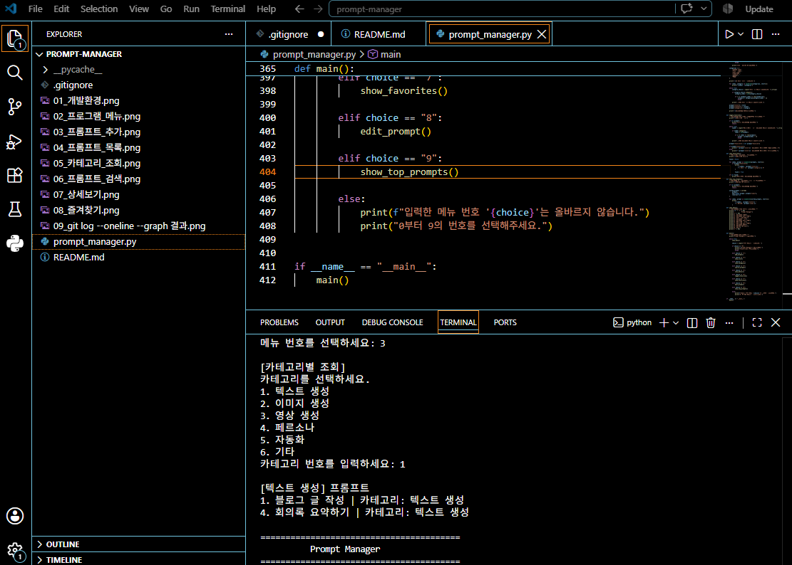
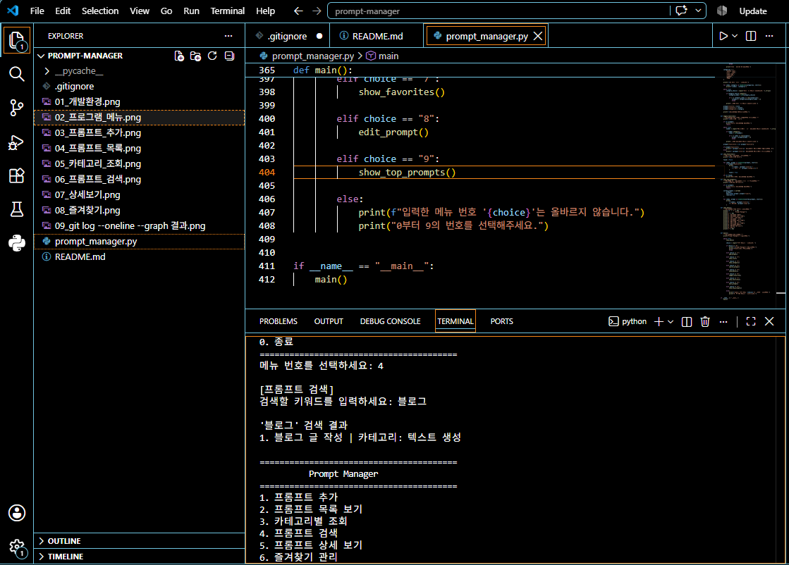
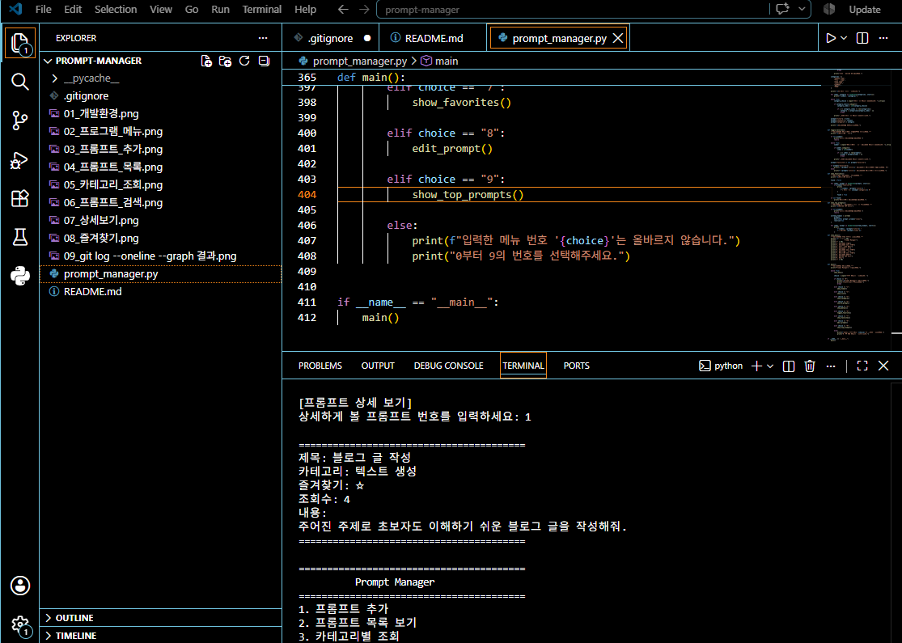
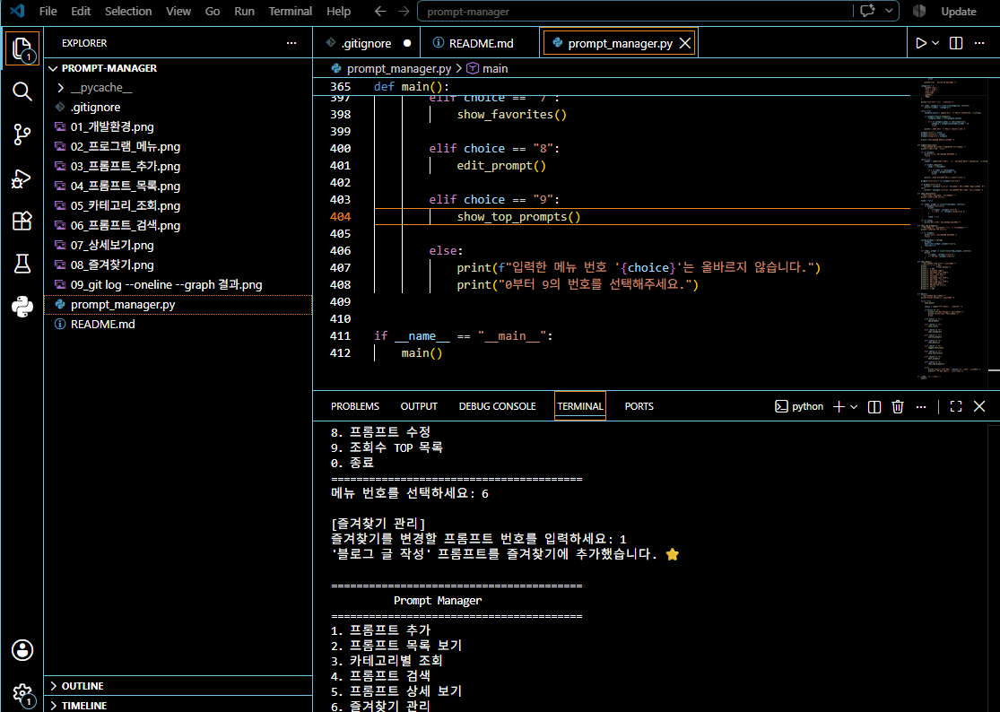
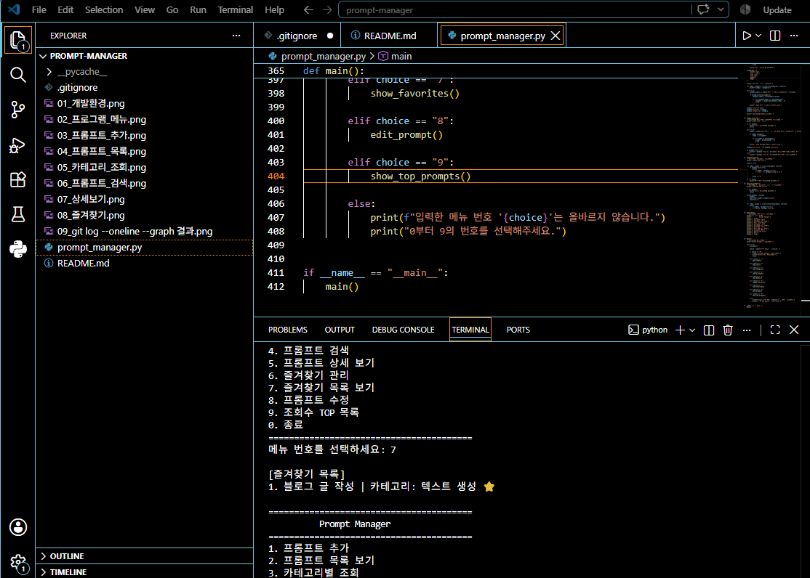
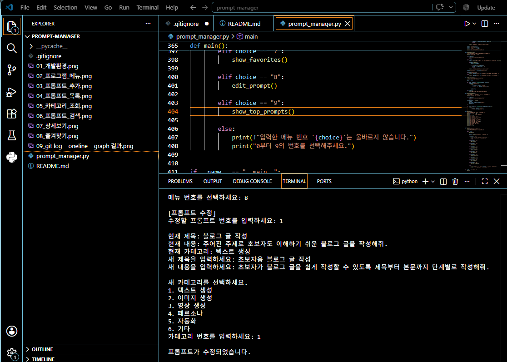
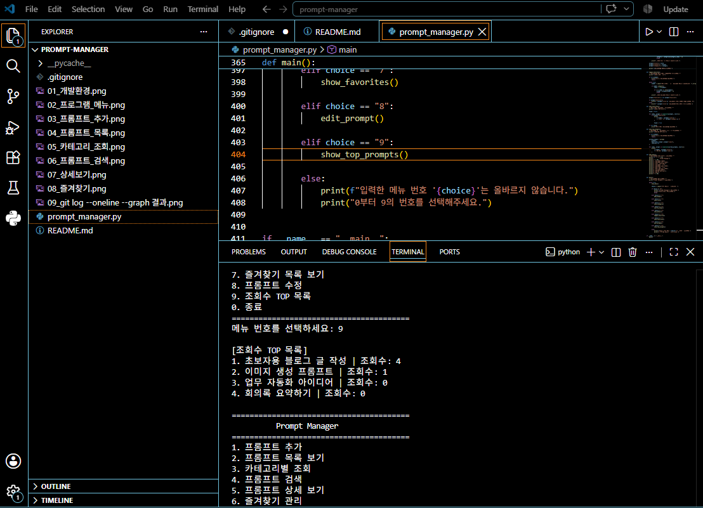

# Prompt Manager

Python 콘솔에서 다양한 프롬프트를 등록하고 관리할 수 있는 프로그램입니다.

프롬프트를 추가하고 목록을 확인하거나, 카테고리별로 조회하고 검색할 수 있습니다.
또한 프롬프트의 상세 정보를 확인하고, 즐겨찾기와 조회수도 관리할 수 있습니다.

## 개발 환경

- Python 3.10 이상
- Visual Studio Code
- Git
- GitHub

## 주요 기능

0. 프로그램 종료
1. 프롬프트 추가
2. 프롬프트 목록 보기
3. 카테고리별 조회
4. 프롬프트 검색
5. 프롬프트 상세 보기
6. 즐겨찾기 관리
7. 즐겨찾기 목록 보기
8. 프롬프트 수정
9. 조회수 TOP 목록


## 프롬프트 카테고리

프롬프트를 종류별로 관리하기 위해 다음 카테고리를 사용합니다.

- 텍스트 생성
- 이미지 생성
- 영상 생성
- 페르소나
- 자동화
- 기타

## 데이터 저장 방법

프로그램에서는 프롬프트 데이터를 Python의 **리스트와 딕셔너리**를 사용하여 저장합니다.

여러 개의 프롬프트를 저장해야 하기 때문에 전체 프롬프트는 리스트에 저장했습니다.

그리고 하나의 프롬프트에는 제목, 내용, 카테고리, 즐겨찾기 여부, 조회수 등의 여러 정보가 필요하기 때문에 딕셔너리를 사용했습니다.

데이터는 프로그램이 실행되는 동안 메모리에 저장됩니다.

따라서 프로그램을 종료하면 새로 추가하거나 수정한 데이터는 초기화됩니다.

## 자료구조를 리스트와 딕셔너리로 선택한 이유

### 리스트를 사용한 이유

여러 개의 프롬프트를 한 번에 관리하기에 편리하기 때문에 리스트를 사용했습니다.

예를 들어 새로운 프롬프트를 추가할 때 `append()`를 사용하면 리스트에 쉽게 추가할 수 있습니다.

리스트는 반복문을 사용하여 여러 개의 프롬프트를 한 번에 확인하기에도 편리합니다.

### 딕셔너리를 사용한 이유

하나의 프롬프트에는 여러 가지 정보가 필요합니다.

예를 들어 다음과 같은 정보가 있습니다.

- `title` : 프롬프트 제목
- `content` : 프롬프트 내용
- `category` : 카테고리
- `favorite` : 즐겨찾기 여부
- `views` : 조회수

이러한 정보를 딕셔너리의 키와 값으로 관리하면 각각의 데이터가 무엇을 의미하는지 쉽게 알 수 있습니다.

### 두 자료구조를 함께 사용한 이유

전체 프롬프트는 리스트로 관리하고, 각각의 프롬프트는 딕셔너리로 관리했습니다.

전체적인 구조는 다음과 같습니다.

```text
리스트
 ├── 딕셔너리 → 프롬프트 1
 ├── 딕셔너리 → 프롬프트 2
 └── 딕셔너리 → 프롬프트 3
 ```

이렇게 하면 여러 개의 프롬프트를 하나의 리스트에서 관리하면서 각 프롬프트의 여러 정보도 딕셔너리로 쉽게 관리할 수 있습니다.

## while 반복문을 사용한 이유

프로그램의 메인 메뉴에서는 사용자가 여러 기능을 계속 사용할 수 있어야 합니다.

예를 들어 사용자가 프롬프트 목록을 확인한 다음 다시 메인 메뉴로 돌아와서 프롬프트를 추가할 수도 있어야 합니다.

그래서 메인 메뉴를 while True 반복문으로 만들었습니다.

```python
while True:
    show_menu()

    choice = input("메뉴 번호를 선택하세요: ")

    if choice == "0":
        print("프로그램을 종료합니다.")
        break
```

## 반복문의 동작

1. 프로그램이 실행되면 메인 메뉴를 보여줍니다.
2. 사용자가 메뉴 번호를 입력합니다.
3. 선택한 기능을 실행합니다.
4. 기능 실행이 끝나면 다시 메인 메뉴를 보여줍니다.
5. 사용자가 0을 입력하면 프로그램을 종료합니다.

break를 사용하면 while True 반복문을 빠져나와 프로그램을 종료할 수 있습니다.

또한 프롬프트 추가 기능에서도 제목, 내용, 카테고리 등을 올바르게 입력할 때까지 다시 입력할 수 있도록 while 반복문을 사용했습니다.

## 중복 제목 처리

이 프로그램에서는 같은 제목의 프롬프트를 등록할 수 있습니다.

예를 들어 제목이 똑같더라도 내용이나 카테고리가 다를 수 있기 때문에 제목만 확인해서 등록을 막지 않았습니다.

따라서 같은 제목을 가진 프롬프트도 각각 별도의 데이터로 저장됩니다.

## 조회수 기능

프롬프트 상세 보기 기능을 실행하면 해당 프롬프트의 조회수가 증가하도록 구현했습니다.

조회수는 프롬프트 딕셔너리의 views 값으로 관리합니다.

또한 조회수가 높은 프롬프트를 확인할 수 있도록 조회수 TOP 목록 기능을 추가했습니다.

이를 통해 어떤 프롬프트가 많이 조회되었는지 쉽게 확인할 수 있습니다.

## 즐겨찾기 기능

자주 사용하는 프롬프트를 쉽게 찾을 수 있도록 즐겨찾기 기능을 구현했습니다.

프롬프트의 favorite 값을 사용하여 즐겨찾기 여부를 관리합니다.

메뉴에서 즐겨찾기를 추가하거나 해제할 수 있으며, 즐겨찾기로 설정한 프롬프트만 모아서 확인할 수도 있습니다.

## 프롬프트 수정 기능

등록된 프롬프트의 내용을 수정할 수 있도록 프롬프트 수정 기능을 구현했습니다.

프롬프트의 제목, 내용, 카테고리 등의 정보를 수정할 수 있습니다.

## 브랜치를 나누어 개발한 이유

Git을 사용할 때 새로운 기능을 바로 main 브랜치에서 개발하지 않고 기능별로 별도의 브랜치를 만들어 작업했습니다.

이렇게 하면 새로운 기능을 개발하는 과정에서 문제가 발생하더라도 기존의 안정적인 main 브랜치에 바로 영향을 주는 것을 줄일 수 있습니다.

예를 들어 프롬프트 목록 기능을 개발할 때 다음과 같이 기능 브랜치를 만들었습니다.

```python
git checkout -b feature/prompt-list
```
feature/prompt-list 브랜치에서 기능을 개발하고 테스트한 후 작업이 완료되면 main 브랜치에 병합했습니다.
```python
git checkout main
git merge feature/prompt-list
```

## 브랜치 작업 흐름

```python
main
 │
 ├── feature/prompt-list
 │       │
 │       └── 프롬프트 목록 기능 개발 및 테스트
 │
 └── main ← 기능 브랜치 병합
 ```

## Merge Conflict가 발생하는 이유

Git에서는 서로 다른 브랜치에서 같은 파일의 같은 부분을 수정하면 Merge Conflict가 발생할 수 있습니다.

Git 입장에서는 두 브랜치의 내용 중 어느 것을 사용해야 할지 자동으로 결정할 수 없기 때문에 충돌이 발생합니다.

## Merge Conflict 해결 방법

1. git merge를 실행합니다.
2. 충돌이 발생하면 Git이 충돌한 파일을 알려줍니다.
3. VSCode에서 해당 파일을 엽니다.
4. <<<<<<<, =======, >>>>>>> 표시를 확인합니다.
5. 최종적으로 사용할 내용을 선택합니다.
6. 충돌 표시를 모두 삭제합니다.
7. 파일을 저장합니다.
8. 해결한 파일을 Staging 영역에 추가합니다.

```python
git add 파일명
```
이후 커밋하여 충돌 해결 내용을 저장할 수 있습니다.

## 카테고리 변경 방법

프로그램에서 사용하는 카테고리를 추가하거나 변경하려면 add_prompt() 함수와 show_category() 함수의 categories 리스트를 수정해야 합니다.

현재 카테고리는 다음과 같습니다.

- 텍스트 생성
- 이미지 생성
- 영상 생성
- 페르소나
- 자동화
- 기타

새로운 카테고리를 추가할 경우 두 함수의 categories 리스트에 동일하게 추가해야 합니다.

두 함수의 카테고리 목록을 동일하게 유지해야 프롬프트 추가 기능과 카테고리별 조회 기능에서 같은 카테고리를 사용할 수 있습니다.

## 실행 방법

프로젝트 폴더에서 다음 명령어를 실행합니다.

```python
python prompt_manager.py
```
프로그램이 실행되면 메인 메뉴가 나타납니다.

```python
0. 프로그램 종료
1. 프롬프트 추가
2. 프롬프트 목록 보기
3. 카테고리별 조회
4. 프롬프트 검색
5. 프롬프트 상세 보기
6. 즐겨찾기 관리
7. 즐겨찾기 목록 보기
8. 프롬프트 수정
9. 조회수 TOP 목록
```
메뉴 번호를 입력하면 해당 기능을 사용할 수 있습니다.

0을 입력하면 프로그램이 종료됩니다.

## GitHub 저장소

프로젝트 소스 코드와 README 문서는 아래 GitHub 저장소에서 확인할 수 있습니다.

https://github.com/x17545/prompt-manager

## 커밋 정책

프로젝트에서는 하나의 기능 또는 의미 있는 변경 단위를 기준으로 커밋했습니다.

예를 들어 다음과 같이 기능별로 커밋 내용을 구분했습니다.

- 프롬프트 추가 기능 구현
- 프롬프트 목록 기능 구현
- 프롬프트 검색 기능 구현
- 즐겨찾기 관리 및 목록 기능 구현
- 프롬프트 수정 기능 구현
- 조회수 기록 기능 구현
- 조회수 TOP 목록 기능 구현
- README 문서 작성

README와 같은 문서 수정도 의미 있는 변경 단위로 나누어 커밋했습니다.

이렇게 기능별로 커밋하면 나중에 GitHub에서 어떤 기능이 언제 추가되었는지 확인하기 쉽습니다.

## 개발 중 발생한 오류와 해결 방법

프로그램을 개발하고 README를 작성하는 과정에서 몇 가지 오류와 문제가 발생했습니다.
오류가 발생한 원인을 확인하고 해결한 후 다시 실행하여 정상적으로 동작하는지 확인했습니다.

### 1. GitHub Push 오류

#### 발생한 문제

GitHub에 변경 내용을 Push하려고 했을 때 다음과 같은 오류가 발생했습니다.

```text
! [rejected] main -> main (fetch first)
error: failed to push some refs to 'https://github.com/x17545/prompt-manager.git'
```

원인

GitHub의 main 브랜치에 로컬 저장소에는 없는 변경 내용이 먼저 반영되어 있었기 때문에 발생했습니다.

해결 방법

먼저 원격 저장소의 변경 내용을 가져온 후 다시 Push했습니다.

```text
git pull origin main
git push origin main
```

### 2. README 이미지가 표시되지 않는 문제

발생한 문제

README에 실행 화면 이미지를 추가했지만 GitHub에서 이미지가 정상적으로 표시되지 않았습니다.

원인

이미지 파일 이름에 한글이 포함되어 있어 파일 경로가 깨져 표시되는 문제가 발생했습니다.

해결 방법

이미지 파일 이름을 영어로 변경했습니다.

예를 들어:

```text
01_프로그램_메인메뉴.png
```
를

```text
01_main_menu.png
```
로 변경했습니다.

나머지 이미지 파일도 영어 이름으로 변경하고 README의 이미지 경로도 함께 수정했습니다.

```text

```
그 결과 GitHub README에서 이미지가 정상적으로 표시되었습니다.

### 3. README 코드 블록이 끝나지 않는 문제

발생한 문제

README에 Python 코드를 작성한 후 코드 아래의 설명까지 회색 배경으로 표시되는 문제가 발생했습니다.

원인

Markdown 코드 블록을 닫는 ```가 올바른 위치에 작성되지 않았습니다.

해결 방법

코드가 끝나는 부분에 ```를 추가하여 코드 블록을 닫았습니다.

```text
while True:
    show_menu()

    choice = input("메뉴 번호를 선택하세요: ")

    if choice == "0":
        print("프로그램을 종료합니다.")
        break
```
코드 블록을 정확하게 닫은 후 아래의 설명을 일반 Markdown 문장으로 작성했습니다.    

### 4. README 한글이 깨져 보이는 문제

발생한 문제

README를 작성하는 과정에서 VSCode에서 한글이 깨져 보이는 문제가 발생했습니다.

원인

파일의 문자 인코딩 문제로 한글이 정상적으로 표시되지 않는 경우가 있었습니다.

해결 방법

VSCode에서 README.md의 파일 인코딩을 확인하고 UTF-8로 저장했습니다.

이후 GitHub에서 README를 확인하여 한글이 정상적으로 표시되는지 확인했습니다.

## 실행 화면

### 1. 프로그램 메인 메뉴


### 2. 프롬프트 목록



### 3. 프롬프트 추가



### 4. 카테고리별 조회



### 5. 프롬프트 검색



### 6. 프롬프트 상세보기 및 조회수



### 7. 즐겨찾기 관리



### 8. 즐겨찾기 목록



### 9. 프롬프트 수정



### 10. 조회수 TOP 목록



